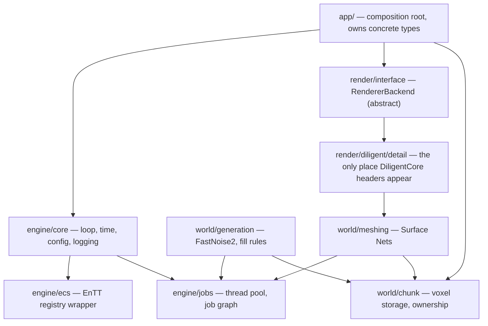

# C++ Voxel Engine — Project Brief & Build Roadmap

A master brief for the `C++-voxel` branch. Written to be read by Claude Code, phase by phase —
not implemented in one pass. Pair with the `cpp-heavy-templates` skill (`SKILL.md` + its
`references/*.md`); this brief says what to build and in what order, the skill says how to write
the C++ once building it.

This is a separate, parallel track from the earlier Bevy/Rust exploration anchored on `VoxelHex`
(the `Voxel` branch) — not a replacement for it. That work stays where it is; this document
governs the `C++-voxel` branch only.

For the machine-specific build recipe and every toolchain gotcha hit during Phase 0, see
[`CLAUDE.md`](CLAUDE.md) — read it before running `cmake`.

Table of contents: [0. How to use this document](#0-how-to-use-this-document) ·
[1. Vision, scope, and the John Lin reference](#1-vision-scope-and-the-john-lin-reference) ·
[2. Technology decisions](#2-technology-decisions) ·
[3. Architecture & module map](#3-architecture--module-map) ·
[4. Folder & file structure](#4-folder--file-structure) ·
[5. Memory, ownership & data layout](#5-memory-ownership--data-layout) ·
[6. Concurrency plan](#6-concurrency-plan) ·
[7. Rendering integration — Diligent](#7-rendering-integration--diligent) ·
[8. World generation & meshing pipeline](#8-world-generation--meshing-pipeline) ·
[9. Build system, concretely](#9-build-system-concretely) ·
[10. Testing & validation](#10-testing--validation) ·
[11. Phased roadmap](#11-phased-roadmap) ·
[12. Guardrails for Claude Code](#12-guardrails-for-claude-code) ·
[13. Research appendix — sources & subagent prompts](#13-research-appendix--sources--subagent-prompts) ·
[14. Open questions / what would change this plan](#14-open-questions--what-would-change-this-plan)

## 0. How to use this document

The real question behind the request, restated. "Make the voxel game" as written could mean (a)
write the code now, or (b) produce the planning document that a separate Claude Code session
executes in stages. The request is explicit that Claude Code can't finish this in one pass and
that the deliverable is "the full prompt of the game" — that's (b). Nothing in here is code to
run today; it's the brief the next several Claude Code sessions work from, one phase at a time.

"Skeletons," disambiguated. Read as engine skeleton — the architectural scaffold (core loop, ECS
wiring, job system stub) — not literal character skeletons/animation rigs. It's listed alongside
"grounds" and "map generating," i.e. world-systems, and nothing elsewhere in the request or prior
context mentions characters or animation. If that's wrong, say so and §3–§4 retarget easily.

The order this brief enforces, and why it isn't arbitrary. Phases 0–3 (repo scaffold, engine
skeleton, world generation, meshing to an in-memory mesh buffer) need no GPU and no display — they
run headlessly. Phase 4 (actually standing up DiligentCore/DiligentFX, opening a window, drawing a
frame) needs a real GPU with a working D3D12/Vulkan/GL driver and a display. This matters
concretely: a no-GPU headless environment can build and correctness-test Phases 0–3 end to end,
but cannot run Phase 4 at all. Validate the CPU-side pipeline by dumping generated chunk meshes to
`.obj`/`.ply` and inspecting them in a separate viewer (Blender, MeshLab, or even just a
vertex/triangle-count sanity check) rather than needing a render target. Don't attempt Phase 4
anywhere without confirming a GPU + driver + display are actually available first — this was
flagged as an open question for the Bevy/`VoxelHex` track too, and it applies here with more
force, since Diligent has no headless/software-rasterizer fallback path the way, say, a pure CPU
renderer would.

Every phase in §11 is sized to be one Claude Code session, not the whole engine. Read the phase's
own "definition of done" before starting it, and stop there — resist folding in the next phase's
work just because it's adjacent.

Skill discipline. Before writing code in any area, re-read the matching `references/*.md` file
fresh — don't work from a memory of what it said earlier in a long session. Before adding any
dependency not already decided in §2, run the `references/library-research.md` protocol rather
than picking from memory, even for something that feels obvious.

## 1. Vision, scope, and the John Lin reference

### 1.1 Who John Lin is and what's actually confirmed about his work

This needed research rather than a guess, so here's what's grounded and where it came from, kept
separate from what isn't.

Confirmed directly from his own blog and GitHub. John Lin (GitHub `Lin20`, Twitter/X
`@ProgrammerLin`, blog at `voxely.net`) is an indie voxel-engine developer whose devlogs and blog
posts date back to at least 2017. PC Gamer's November 2020 coverage
(pcgamer.com/john-lins-beautiful-physics-sandbox-gives-me-minecraft-vibes) describes a then-year-old,
untitled voxel sandbox with simulated water, pitched as evoking Minecraft-style creative/exploratory
play without being a clone, with Lin stating an intent to turn it into a released game.

His blog's "The Perfect Voxel Engine" (Sept 2021, voxely.net/blog/the-perfect-voxel-engine/) lays
out his actual design philosophy in his own words, and it's more specific and more useful than
anything a video transcript would give us:

- He explicitly rejects committing to one voxel data format (naming sparse voxel octrees by name
  and arguing they're only acceptable — not great — at storage and rendering, poor for everything
  else a game needs: collision, global illumination, pathfinding, arbitrary per-voxel attributes,
  dynamic objects).
- His answer is a general volume pipeline with three stages — Allocation (where the buffer for a
  chunk of voxel data actually lives: CPU-recycled, GPU-resident, etc., swappable), Tagging
  (attaching arbitrary named, typed attributes to a volume — albedo, normal, vegetation state, a
  Minecraft-redstone-like logic value — without hard-coding a single struct layout), and
  Conversion (format-to-format transforms, the same way `assimp` converts arbitrary mesh formats
  into whatever a GPU needs). This is the same modularity philosophy as his "Object-Oriented ECS
  Design" post (July 2021), which argues for a hybrid OOP+ECS engine core specifically to support
  managed/native interop (a C++ core with C#-callable bindings for content authoring) and
  moddability.
- For rendering, the post's closing section is explicit that his target is Vulkan hardware ray
  tracing — building a BLAS per voxel format with format-specific intersection and callable
  shaders, not a rasterized triangle-mesh pipeline.
- The blog's comment thread contains a real, verifiable data point: a commenter identifies
  themself as Gabe Rundlett (gaberundlett.com), a contemporary voxel-ray-tracing devlog author in
  his own right, reaching out in March 2023 — a legitimate adjacent reference if Claude Code ever
  needs a second, currently-more-active source on the same style of project (see §13).
- Public updates from Lin thin out after ~2021–2023 per the same comment thread ("a whole year
  without news," "I hope you come back to YouTube soon") — the project is credibly still
  unreleased, and not something with a public 2024–2026 update to point to.

Confirmed directly from his own open-source repository. `Lin20/BinaryMeshFitting` (MIT license,
391 stars, described by Lin as the successor to an earlier `PushingVoxelsForward`) is real,
buildable source code, and it answers "how do John Lin's voxels look" far more precisely than the
linked video could on its own:

- Meshing: not marching cubes on a density field, and not dual contouring on full Hermite data
  (position and normal per edge crossing). It's a binary-data-driven variant — voxels are in/out,
  not a scalar field — processed with an iterative dual-mesh smoothing pass (Ohtake & Belyaev's
  Dual/Primal Mesh Optimization for Polygonized Implicit Surfaces, 2002; Nielson's Dual Marching
  Cubes, 2004) layered with manifold dual contouring (Ju, Losasso, Schaefer & Warren 2002;
  Schaefer, Ju & Warren 2007) so the octree traversal and the surface extraction happen together.
  Sharp features (an edge, not just smooth terrain) are recovered with a QEF (quadratic error
  function) minimizer only when gradient data is supplied — otherwise the surface is smooth. Quads
  are preferred over triangles to cut primitive count.
- Stack: GLEW, GLFW, and FastNoiseSIMD (Auburn's earlier library, superseded today by FastNoise2,
  same author) are its actual dependencies, confirmed from its own `README.md` and
  `cmake/Modules/Find*.cmake` files. GLM is present too (`FindGLM.cmake`). This directly validates
  the windowing and math library picks in §2.2/§2.3 below — not just "a reasonable choice" but the
  literal stack the reference project used.
- Performance approach: pooled memory, multithreading, and bit-level tricks for fast chunk
  extraction, written up in Lin's own self-published PDF ("Fast Cell Mask Building with
  Pseudo-SIMD Techniques," Dec 2017).
- Its own to-do list is the most honest scope signal available: done — dual marching cubes/
  manifold dual contouring, level of detail, LOD stitching, world updates, multithreaded
  extraction, mesh processing. Not done, even in his own reference implementation — clean
  processing between chunks, density-based vertex positioning, sharp-feature support, GPU
  offloading, real-time modification. That's a genuine, first-party statement of where the hard
  remaining problems are, and it's exactly why §1.2 scopes v1 well short of feature parity with
  this.

Not confirmed by this pass. The specific video at youtube.com/watch?v=1R5WFZk86kE — a direct fetch
returned a rate-limit error, and it didn't surface by title through search either, so its specific
content (as opposed to the creator's broader, well-documented body of work above) isn't
independently verified here. If a specific moment or claim from that video matters, the fix is
simple: say what it showed and this section updates against it directly rather than against
inference.

### 1.2 Explicit scope for this project (v1)

In scope, matching "basic version… land, mountains, and water" as stated: procedurally generated
terrain (heightmap/density-driven, not hand-authored), smooth (non-blocky) mesh extraction, a
water level, a flythrough or basic first-person camera to actually look at it, and the engine
plumbing (ECS, job system, chunk streaming) needed to generate and render that terrain at a
reasonable draw distance.

Explicitly out of scope for v1 (candidates for a stretch phase, not v1): Lin's multi-format volume
pipeline (one well-chosen format, done well, beats a general format-conversion framework at this
stage); hardware ray tracing (rasterized meshes via Diligent, see §2.1); destructible/editable
terrain; vegetation, structures, or "redstone"-style per-voxel logic; C#/managed scripting layer;
networking/multiplayer; modding support. Every one of these is a legitimate next phase once the
core pipeline is proven — none of them block "does the terrain generate, mesh, and render."

## 2. Technology decisions

Per `references/library-research.md`: name the runner-up and the specific reason it lost, don't
just assert a pick. Two of these (rendering API, build/fetch tooling) were specified directly and
are recorded here rather than re-litigated; the rest are real decisions.

### 2.1 Rendering: DiligentEngine (Core + Tools + FX)

Given, not decided — recorded here for precision about what's actually being used. DiligentFX is
confirmed directly (fetched from the repo itself) to be Diligent Engine's high-level rendering
layer, Apache-2.0, 450 stars, 2,043 commits, with active CI across
Windows/UWP/Linux/macOS/iOS/tvOS/Web (Emscripten) as of this pass — that reads as actively
maintained, not abandoned. Its components: a PBR (physically-based) renderer built around glTF
assets (via `DiligentTools`' `AssetLoader`), Hydrogent (a Hydra render-delegate implementation,
USD-related), a shadow-mapping component, and a `PostProcess` folder with screen-space
reflections, screen-space ambient occlusion, depth of field, bloom, epipolar (atmospheric) light
scattering, temporal anti-aliasing, and tone-mapping shader utilities. There's also a `Radient`
folder — **confirmed during Phase 0** (not just theorized): it's a real scene/render pipeline
component under `DiligentFX/Radient/`, with `Scene/RadientSceneImpl`, `Scene/RadientSceneWriterImpl`,
`Render/RadientRenderPipeline`, and a `Render/Tessera/` subsystem (`RadientTesseraGeometryPass`,
`RadientTesseraDrawableCache`, `RadientTesseraRenderTechnique`) — resolving §13's open research
question. Its exact API surface/relevance to a custom terrain pass is still unexplored.

What we actually use from it in v1: `DiligentCore` (device/context/swap-chain/pipeline-state — the
part every Diligent app needs) and enough of `DiligentTools` to get `DiligentFX` to build (it
depends on Tools). We are not adopting the glTF/PBR pipeline for terrain — voxel chunk meshes
aren't glTF assets, and pulling in a full PBR material pipeline for a flat-shaded or simple-lit
terrain pass is scope creep. A hand-written minimal vertex/pixel shader pair (§7) is the v1 render
path. DiligentFX's post-process utilities (tone mapping, later bloom/SSAO) are realistic additions
once a custom geometry pass exists to feed them — noted as a stretch item in §11, not v1 work.

Confirmed cross-platform/backend support (from DiligentCore's own README): Direct3D11,
Direct3D12, Vulkan, Metal, OpenGL 4.1+/OpenGL ES 3.0+, and WebGL 2.0, behind one common front-end
API, with HLSL as the universal shading language (cross-compiled to GLSL/MSL/DXBC-DXIL/SPIR-V per
backend as needed). Backend is selectable at runtime (Diligent's own sample tutorials take
`--mode d3d11|d3d12|vk|gl` on the command line) — worth wiring the same switch into our own app
early, since it makes cross-backend bugs visible immediately instead of only on whatever machine
happens to test a different platform later. **Confirmed during Phase 0**: this dev machine builds
D3D11, D3D12, OpenGL, and Vulkan backends all successfully with real MSVC — all four are available
for Phase 4, not just OpenGL/Vulkan as first suspected under a MinGW toolchain attempt.

### 2.2 Windowing: GLFW

Decisive pick, and better-grounded than a generic recommendation would be: this is the literal
library John Lin's own `BinaryMeshFitting` uses (§1.1), and the integration pattern with a
native-handle graphics API like Diligent's is well-established generically — set the
`GLFW_CLIENT_API` window hint to `GLFW_NO_API` (skip GLFW's own GL context creation) and pull the
native handle (`glfwGetWin32Window`/`glfwGetX11Window`/`glfwGetCocoaWindow` per platform) to hand
to the graphics API. This exact technique is confirmed in use in Dawn (Google's WebGPU
implementation) for its D3D12 backend binding, and is the standard answer on GLFW's own discourse
for pairing GLFW with a non-OpenGL API. DiligentCore's own initialization pattern (confirmed
directly from its README) takes exactly a native handle this way: `Win32NativeWindow Window{hWnd}`
gets passed into `CreateSwapChainD3D11`/`D3D12` etc. This isn't documented as Diligent's own
first-party windowing recommendation (their own sample apps roll per-platform native windowing
internally, not GLFW) — but it satisfies Diligent's actual requirement (a native handle) with far
less code than hand-rolling Win32/X11/Cocoa window creation ourselves, which is out of proportion
for an engine-skeleton phase.

Runner-up, and why it lost: SDL2/SDL3. Comparable maturity and an equally standard native-handle
extraction path (`SDL_GetWindowWMInfo` / SDL3's properties API). It loses on fit, not quality: SDL
pulls in audio/input/gamepad subsystems this project doesn't need yet, where GLFW is
windowing+input only and is what the reference project already uses — no reason to diverge.

### 2.3 Math: GLM

Decisive pick, also validated by `BinaryMeshFitting`'s own `FindGLM.cmake`. DiligentCore ships its
own lightweight math types for internal/utility use, but the device/context/resource API itself is
POD-buffer based — vertex and constant-buffer contents are plain structs you define and
`memcpy`/`Map` into a GPU buffer yourself, not a type Diligent forces on you. That means GLM isn't
fighting the rendering API at the boundary; there's no per-call conversion tax. Real gotcha to flag,
not to discover by staring at a garbled screen: HLSL constant-buffer packing rules (each `float4`
register slot is a 16-byte boundary; a `float3` followed by a scalar can silently straddle one)
don't match GLM's tightly-packed default layout. Every cbuffer-mirroring struct needs explicit
padding (or restrict cbuffer fields to `glm::vec4`/`glm::mat4` and do the packing by hand) — this
is exactly the kind of "looks right, renders garbage" bug that's expensive to debug blind and cheap
to design around up front.

### 2.4 ECS: EnTT

Decisive pick, with real numbers, not "EnTT is popular." Cross-referencing two independent
benchmark sources (flecs-hub/ecs_benchmark and abeimler/ecs_benchmark): EnTT (sparse-set based,
header-only) is roughly an order of magnitude faster than flecs for single-component add/remove
operations (~0.0095 vs. ~0.076 for adding one component to 1M entities, per the flecs-hub numbers)
— the exact operation pattern a chunk-management layer does constantly (spin up an entity per
loading chunk, attach/detach state components as generation/meshing/upload stages complete). It's
also header-only, trivial to CPM-fetch, and already the example EnTT/GLM/Eigen/Boost.Hana/range-v3
pairing `references/modular-architecture.md` §1 uses to illustrate good folder organization —
using it as the actual dependency, not just the illustrative example, keeps the codebase's own
documentation and its real dependencies pointing the same direction.

Runner-up, and why it lost: flecs. A multithreaded, C-core archetype ECS with real advantages EnTT
doesn't have out of the box — built-in queries, hierarchies/relationships, and a module/addon
system — and it wins some of the same benchmark's batched-entity-creation cases outright. It loses
for v1 on fit: those higher-level features (scripting-adjacent query composition, built-in
hierarchies) solve problems this project doesn't have yet, and EnTT's simplicity keeps the
engine-skeleton phase small. Worth re-evaluating for real if a later phase wants scripted/
data-driven entity queries at scale.

### 2.5 Terrain noise: FastNoise2

Decisive pick — direct successor to the FastNoiseSIMD that `BinaryMeshFitting` itself depends on,
so this is also a continuity pick, not a cold one. Confirmed current (wiki edited into February
2026, active GitHub Actions CI, MIT license): C++17, template-based, node-graph noise composition
compiled per-SIMD-level (Scalar/SSE2/SSE4.1/AVX2/AVX512/NEON) with runtime dispatch to the fastest
level the CPU actually supports. Its own continuously-tracked benchmark table (not a one-off
marketing number) shows roughly 776M 2D value-noise points/sec on AVX2 versus ~114M for FastNoise
Lite and ~102M for legacy FastNoise — a real, dated, cited comparison, not a "should be faster"
claim. On a pure-CPU-generation workload, this matters directly: heightmap/density generation is
CPU-bound regardless of rendering backend, so the SIMD headroom is directly usable for
however-many-octaves of terrain noise the world-gen phase ends up wanting.

### 2.6 Meshing algorithm: phased, not a single pick

This is the one place where matching "the John Lin look" and matching "basic version" pull in
different directions, so the honest answer is a phase gate rather than one winner:

- v1 (Phase 3): Naive Surface Nets. Smooth, non-blocky terrain (correct aesthetic direction for
  land/mountains/water), a fraction of the implementation complexity of the dual-contouring
  family — one vertex per surface-crossing cell, positioned as the average of edge crossings, no
  QEF solve, no octree traversal to get right on the first attempt. This gets the world-gen →
  mesh → render pipeline proven end to end fast, which is the actual bottleneck for a project that
  can't be built in one pass.
- Stretch (post-Phase 6): John Lin's actual technique. Binary-data dual marching cubes + manifold
  dual contouring with QEF sharp-feature recovery (§1.1) — same academic citations already in
  hand (Ohtake & Belyaev 2002; Nielson 2004; Ju/Losasso/Schaefer/Warren 2002; Schaefer/Ju/Warren
  2007). This is strictly more implementation complexity for a real payoff (sharp features survive
  smoothing; arguably better LOD stitching behavior) — worth doing once Surface Nets has proven
  the rest of the pipeline works, not before.
- Rejected: greedy meshing (Minecraft-style blocky). Simplest of all three, and explicitly the
  wrong aesthetic — it's the one meshing choice that can't produce "mountains" that look like
  mountains rather than a staircase. Named and dismissed rather than silently skipped, since it's
  the first thing most voxel-engine tutorials reach for.

### 2.7 Build & dependency fetching: CMake + CPM.cmake

Given, not decided — recorded with the one real gotcha worth resolving before, not during, Phase
0.

The concrete fetch strategy. DiligentEngine's own root `CMakeLists.txt` (confirmed directly, read
from the repo) already does the right orchestration: it `add_subdirectory`s `DiligentCore`
unconditionally, `DiligentTools` behind a `DILIGENT_BUILD_TOOLS` option, and `DiligentFX` behind
`DILIGENT_BUILD_FX` (with a check that disables FX automatically if Tools is off, since FX depends
on it) — plus `DiligentSamples` behind its own option, which we don't need. The straightforward
move is to CPM-fetch the super-repo as one package, not split Core/Tools/FX into three separate
`CPMAddPackage` calls:

```cmake
CPMAddPackage(
  NAME DiligentEngine
  GITHUB_REPOSITORY DiligentGraphics/DiligentEngine
  GIT_TAG <pin to a specific commit/tag — Diligent doesn't cut frequent versioned
           releases the way some libraries do; check the repo's own tags/commit
           history at fetch time and pin deliberately rather than tracking master>
  OPTIONS
    "DILIGENT_BUILD_SAMPLES OFF"
    "DILIGENT_BUILD_TOOLS ON"
    "DILIGENT_BUILD_FX ON"
)
```

**Phase 0 update**: the coordinated tag `API256015` was tried first and works for the *fetch*
(submodules populate correctly — see below), but its vendored SPIRV-Tools snapshot fails to build
under this machine's MSVC 19.50 (C++20 warning C5232 elevated to error C2220 by DiligentCore's own
`/WX`). Re-pinned to master commit `aca2285` (2026-08-16), which builds clean — see `CLAUDE.md`
for the full story and `cmake/Dependencies.cmake` for the live pin.

The submodule-fetch gotcha this section originally flagged as a risk — **resolved, confirmed
working**: CMake's `FetchContent` (which CPM wraps) does correctly recursively initialize
DiligentCore/Tools/FX/Samples' nested submodules (SPIRV-Cross, SPIRV-Headers, SPIRV-Tools,
Vulkan-Headers, glslang, googletest, volk, xxHash, and more) on a plain fetch — verified directly
during Phase 0, not assumed. The *actual* gotcha turned out to be elsewhere: FetchContent's
separate git "update" step (which re-checks a pinned ref for upstream changes on every configure)
fails under this environment unless `GIT_EXECUTABLE` is pointed at the real `git.exe` explicitly
and `UPDATE_DISCONNECTED TRUE` is set — see `CLAUDE.md`.

Everything else about the build (`FILE_SET HEADERS`, one `CMakeLists.txt` per folder, no
`GLOB_RECURSE`, `Dependencies.cmake` pinning every tag in one place) follows
`references/modular-architecture.md` §1 exactly as written — no deviation needed.

## 3. Architecture & module map

Interfaces at every module boundary, concrete types stay internal —
`references/modular-architecture.md` §2, applied here rather than restated:



Why `render/interface` exists even though there's only one backend today. This is a type-erasure
boundary in the `templates-and-metaprogramming.md` §5 sense, not premature abstraction: `world/`,
`engine/`, and `app/` should never `#include` a DiligentCore header directly. Concretely, this buys
two things worth having from day one — (1) `world/meshing` and its tests build and run headlessly
with zero DiligentCore in the include graph, which is exactly what §0's headless-phase split
needs, and (2) per `compile-time-performance.md` §1, DiligentCore's own headers are exactly the
kind of heavy-if-widely-included dependency worth walling off behind one boundary rather than
letting every translation unit that touches rendering re-parse them. This is a pay-to-save move in
`release-codegen-and-tradeoffs.md` §1's classification (one virtual dispatch per draw-call-batch,
not per-voxel) — a cost worth paying here, unlike, say, a hot per-voxel inner loop.

`world/chunk` has no threading primitives in it (per `SKILL.md`'s house-style rule: keep
concurrency out of a core data layer, put it behind an interface at the edges). `engine/jobs`
operates on chunks from outside; a `Chunk` object itself is a plain data-holder with no mutex, no
atomic, no knowledge that a job system exists.

## 4. Folder & file structure

Two-to-three levels deep, one `CMakeLists.txt` per folder via `add_subdirectory`, one `detail/` +
`namespace detail` per module for internals — `SKILL.md`'s house style, applied to this project's
actual modules. (Phase 0 note: per-folder `README.md`s were deferred — Phase 0's own scope was
"CMakeLists.txt-only stubs" — pick them up whenever a module gets real content.)

```
zxbio-fueld-game-research/          (repo root doubles as the project root on this branch)
├── CMakeLists.txt                    # top-level: options, add_subdirectory(engine|world|render|app|tools)
├── CLAUDE.md                         # machine-specific build recipe + gotchas — READ FIRST
├── PROJECT_BRIEF.md                  # this file
├── cmake/
│   ├── Dependencies.cmake            # every CPMAddPackage call, every tag pinned, in one file
│   └── CompilerWarnings.cmake        # -Wall -Wextra -Wpedantic -Werror / /W4 /WX toggle
├── engine/
│   ├── core/
│   │   ├── include/engine/core/      # Application, Clock, Config, Log — public headers
│   │   ├── src/
│   │   ├── detail/
│   │   ├── tests/
│   │   └── CMakeLists.txt
│   ├── ecs/
│   │   ├── include/engine/ecs/       # thin EnTT registry wrapper, component headers
│   │   ├── detail/
│   │   ├── tests/
│   │   └── CMakeLists.txt
│   └── jobs/
│       ├── include/engine/jobs/      # ThreadPool, Job, JobGraph
│       ├── src/
│       ├── detail/
│       ├── tests/
│       └── CMakeLists.txt
├── world/
│   ├── chunk/
│   │   ├── include/world/chunk/      # Chunk, ChunkCoord, VoxelStorage (paletted)
│   │   ├── detail/
│   │   ├── tests/
│   │   └── CMakeLists.txt
│   ├── generation/
│   │   ├── include/world/generation/ # HeightmapGenerator, TerrainFillRules
│   │   ├── src/                      # FastNoise2 usage lives here, nowhere else
│   │   ├── tests/
│   │   └── CMakeLists.txt
│   └── meshing/
│       ├── include/world/meshing/    # MeshExtractor (interface), SurfaceNetsExtractor
│       ├── src/
│       ├── detail/
│       ├── tests/
│       └── CMakeLists.txt
├── render/
│   ├── interface/
│   │   ├── include/render/interface/ # RendererBackend, MeshHandle, DrawList — no DiligentCore here
│   │   └── CMakeLists.txt
│   └── diligent/
│       ├── include/render/diligent/  # DiligentRendererBackend (public surface: one header)
│       ├── src/
│       ├── detail/                   # every DiligentCore #include lives under here
│       ├── shaders/                  # .hlsl — the hand-written voxel vertex/pixel shaders
│       └── CMakeLists.txt
├── app/
│   ├── src/main.cpp                  # composition root: wires interface -> diligent backend
│   └── CMakeLists.txt
└── tools/
    └── mesh_dump/                    # Phase 0-3 headless validation: chunk -> .obj, no GPU needed
        ├── src/
        └── CMakeLists.txt
```

Each `include/<area>/<module>/` mirrors `modular-architecture.md` §1's
`include/<lib>/<module>/<file>.hpp` nesting. `render/diligent/detail/` is the literal, physical
embodiment of the interface boundary from §3 — if a `.cpp` outside that folder needs a
DiligentCore type, that's the signal the interface is leaking, not a reason to add the include.

## 5. Memory, ownership & data layout

Straight from `references/memory-and-performance.md`, applied to the one data structure this
project actually lives or dies on: chunk voxel storage.

Storage shape. A chunk is a fixed-size grid (default `32³` — tunable, not load-bearing at this
stage) of a small material ID, not a `vec3`/`vec4` per voxel — matching Lin's own critique of
storing full per-voxel attribute structs everywhere in "The Perfect Voxel Engine" (§1.1).
Structure-of-Arrays only matters once a hot loop touches one or two fields of many voxels
(`memory-and-performance.md` §5) — for now that's the meshing pass reading material IDs, so a
single flat `std::vector<uint8_t>` (or `uint16_t` once the material count needs it) per chunk is
the right starting shape, not a struct-of-arrays split that has nothing to split yet.

See M1_2_BRIEF.md §1 for the full palette scheme this flat-array description turns out to be
the ceiling case of.

Allocation. Chunks are a textbook alloc-many/free-together pattern once a render-distance ring of
them loads and unloads together — exactly the case `memory-and-performance.md` §3 names as a real
win for pooling. Per the skill's own house style (`std::pmr` is the default, a hand-rolled arena is
a measured exception, not a starting assumption): back chunk voxel buffers with a
`std::pmr::synchronized_pool_resource` (synchronized, since generation and meshing run on
different job threads) sized for the render-distance chunk count, and only reach for a hand-rolled
bump allocator if profiling later shows the pool itself is the bottleneck.

Ownership. `world/chunk` owns chunks via `std::unique_ptr<Chunk>` in a coordinate-keyed map;
nothing else holds a chunk by pointer for longer than one job's lifetime. The one place
`shared_ptr` is justified: a generated mesh handle that's simultaneously reachable from the chunk
(for "is this chunk's mesh current" bookkeeping) and from the renderer's draw list (for "what do I
draw this frame") — two independent owners with genuinely overlapping lifetimes, which is the
actual `shared_ptr` use case per `memory-and-performance.md` §1, not a default.

## 6. Concurrency plan

From `references/concurrency-and-parallelism.md` §4, applied: a `ThreadPool` (the
`std::jthread`/`std::stop_token` shape worked through in that file) owned by `engine/jobs`, fed by
`world/generation` and `world/meshing`. Concretely, per newly-visible chunk coordinate: generate
(FastNoise2 heightmap/density → material-ID fill) enqueues, then on completion mesh (Surface Nets)
enqueues, then on completion the result crosses back to the main thread for GPU upload — the one
hop that must happen on the thread that owns the Diligent immediate context, unless/until Phase 5
brings in deferred contexts (§7).

Where parallel STL fits and where it doesn't. Heightmap generation over a flat buffer is exactly
the "large input, no cross-element shared mutable state" shape `concurrency-and-parallelism.md` §5
describes for `std::execution::par` — worth trying directly on the FastNoise2 output buffer before
reaching for job-per-chunk parallelism at that specific stage, since it's zero synchronization code
to get wrong. Note the file's own caveat: libstdc++'s parallel STL support depends on oneTBB
actually being linked as of 2026 — confirm it's really parallelizing on the target toolchain rather
than silently running sequential (n/a for the MSVC toolchain this branch actually builds with —
MSVC's parallel STL doesn't have this particular caveat, but re-check if the toolchain ever
changes).

What stays out of `world/chunk` entirely (§3, and the skill's own house-style rule): no mutex, no
atomic, no thread-awareness in the chunk data structure itself. The job system reads/writes chunks
from outside; a chunk has no idea a thread pool exists.

## 7. Rendering integration — Diligent

The section flagged for deep reasoning specifically, so the actual API shape matters more than a
one-line "use Diligent" would convey. This is Phase 4 — GPU-and-display required (§0).

Initialization, the real shape. Confirmed directly from DiligentCore's own documented pattern: a
render device, an immediate context, and a swap chain, created together from a backend-specific
factory, taking the native window handle GLFW hands over (§2.2):

```cpp
// render/diligent/detail/device_init.cpp — the ONLY file that knows this shape exists
Win32NativeWindow Window{hWnd};   // or the Linux/macOS equivalent NativeWindow type
EngineD3D12CreateInfo EngineCI;
auto* pFactory = GetEngineFactoryD3D12();
pFactory->CreateDeviceAndContextsD3D12(EngineCI, &m_pDevice, &m_pImmediateContext);
pFactory->CreateSwapChainD3D12(m_pDevice, m_pImmediateContext, SCDesc,
                                FullScreenModeDesc{}, Window, &m_pSwapChain);
```

Every handle is a `RefCntAutoPtr<T>` (Diligent's own intrusive-refcounted smart pointer, not
`std::shared_ptr` — don't try to wrap it in one). Select the backend the same way Diligent's own
tutorials do (`--mode d3d12|vk|gl`, defaulting to whichever is native for the dev machine) so a
cross-backend regression shows up immediately rather than only on a different machine later.
**Phase 0 confirmed**: D3D11, D3D12, OpenGL, and Vulkan all build on this dev machine — all four
are real options for the `--mode` switch, not just a theoretical list.

The v1 draw path is one hand-written shader pair, not DiligentFX's PBR pipeline (§2.1) — a vertex
shader reading a chunk mesh's position/normal/material-ID attributes, a pixel shader doing flat or
simple Lambertian shading keyed off material ID, one pipeline state object. This is deliberately
the smallest thing that gets mountains and water on screen; DiligentFX's tone-mapping/bloom/SSAO
utilities are realistic additions after this exists to feed them, not before.

Multithreaded command recording — real, and worth using early rather than retrofitting. Diligent's
own `DiligentSamples` ship a dedicated `Tutorial06_Multithreading` demonstrating deferred
contexts — a documented, first-party pattern (D3D11-style deferred-context model, abstracted over
D3D12/Vulkan command buffers underneath) for generating draw commands across multiple threads and
submitting them from one. Given render-distance terrain means dozens-to-hundreds of chunk draw
calls per frame, this is the natural pairing with the job system in §6: chunk mesh command
recording happens on job-pool threads via deferred contexts, submission stays single-threaded on
the immediate context. Worth landing in Phase 5, not Phase 4 — get one chunk drawing correctly on
the immediate context first.

Bindless resources, worth knowing about even if not used immediately. `Tutorial16_BindlessResources`
is the other tutorial directly relevant to a voxel engine's actual draw pattern: many small,
similar draw calls (one or more meshes per chunk) each needing their own resource binding is
exactly the case bindless resources exist to avoid the per-draw binding overhead of. Not a Phase 4
requirement, but flag it now so "why are draw calls the bottleneck at render distance" doesn't have
to be rediscovered from scratch later.

What DiligentTools buys beyond the asset loader we're not using: a working Dear ImGui integration.
Worth pulling in during Phase 6 for a debug overlay (chunk load/mesh/draw counts, camera position,
noise parameters) rather than hand-rolling one — it's a supported, documented pairing, not a
bespoke integration.

## 8. World generation & meshing pipeline

The concrete data flow §3's diagram summarizes, spelled out stage by stage:


Land & mountains: a base heightmap from 2–4 octaves of FastNoise2 fractal/ridge noise, amplitude
scaled per-octave — "mountains" here just means higher-amplitude, lower-frequency octaves
dominating in some regions, not a separate system. Water: a fixed sea-level fill (any cell below a
world-space Y threshold and not already solid becomes a water material ID), rendered with the same
v1 shader pair at first (a distinct, simple material color/alpha) rather than a dedicated water
shader — real transparency/reflection is a stretch item, not a v1 requirement. Both are
deliberately the simplest version that satisfies "land, mountains, and water" as stated, with the
noise-graph and fill-rule complexity as the obvious places to grow later without restructuring the
pipeline around them.

Chunk boundary correctness is the actual hard part, worth calling out explicitly rather than
discovering it as a visual seam later: Surface Nets (like every voxel meshing algorithm) needs to
sample one voxel past a chunk's own boundary to place vertices correctly at the edge, or adjacent
chunks' meshes visibly crack apart. Budget for this in Phase 3's design, not as a bug-fix after
Phase 4 makes the seam visible for the first time.

## 9. Build system, concretely

`references/tooling-testing-and-ci.md` and `references/release-codegen-and-tradeoffs.md`, applied
to this project's own build rather than restated in general terms. **See `CLAUDE.md` for the
actual machine-specific invocation** — this section is the design intent, `CLAUDE.md` is the
verified-working recipe.

Dependencies, pinned in one file (`cmake/Dependencies.cmake`): `DiligentEngine` (§2.1, §7), `entt`
(GitHub `skypjack/entt`), `glm` (GitHub `g-truc/glm`), `glfw` (GitHub `glfw/glfw`), `FastNoise2`
(GitHub `Auburn/FastNoise2`) — every `GIT_TAG` a real tag or commit, checked at fetch time, never
`master`/`main` unpinned.

Compile-time posture (`compile-time-performance.md`, applied): the render/interface boundary (§3)
is already the biggest compile-time win available — DiligentCore's headers are heavy and only
`render/diligent/` ever sees them. Beyond that: a PCH for the genuinely stable, rarely-changing set
(`<entt/entt.hpp>`, GLM headers, the C++ standard library) once more than a couple of modules
exist; `ccache` and `mold`/`lld` from day one (§1's classification: both free — no design cost,
just turn them on) — **deferred to Phase 6** per the roadmap, not added prematurely in Phase 0;
explicit instantiation is unlikely to matter here since there's no small-known-set template hot
spot the way a generic container library would have one.

Release posture (`release-codegen-and-tradeoffs.md` §8–§9, applied directly): no LTO, or
thin/incremental LTO at most, for local dev builds; `-O2`/`/O2` as the working default; full LTO
(with PGO only once there's a real, representative play-session workload to train against — not
before) reserved for an actual "build this to send/ship" configuration, which doesn't exist yet at
this stage of the project and shouldn't be built prematurely. The closing heuristic from §9 of that
file applies directly to where the phases will find the actual hot loop: it's almost certainly
meshing and draw-call submission, not world generation (which runs once per chunk-load, not per
frame) — profile before spending anything pay-to-win on either.

CI matrix (`tooling-testing-and-ci.md` §5): build+test (the actual point of Phases 0–3, runnable
headlessly), ASan+UBSan together, TSan separately (the job system in §6 is exactly the kind of
code TSan exists to catch problems in), clang-tidy wired via `CMAKE_CXX_CLANG_TIDY` — all four as
parallel jobs from the first commit that has code to build, not retrofitted later. **Phase 6**
work per the roadmap.

## 10. Testing & validation

Headless validation for Phases 0–3 (§0): the `tools/mesh_dump/` target takes a chunk coordinate,
runs generation + meshing, and writes the result to `.obj` — the whole CPU-side pipeline is
checkable by triangle/vertex counts and by opening the file in a viewer on a different machine,
with zero DiligentCore in the loop.

Unit tests, per `tooling-testing-and-ci.md` §3: noise determinism (same seed + coordinate → same
output, across runs and across threads); Surface Nets boundary cases explicitly, not just the
convenient common case — an all-air chunk (empty mesh, not a crash), an all-solid chunk (empty
mesh, correctly, since there's no surface), and the chunk-boundary sampling from §8 specifically
(verify two adjacent chunks produce vertices that actually meet, not a visual assertion but a
geometric one on the vertex positions).

Benchmarks (`tooling-testing-and-ci.md` §4, Google Benchmark): generation time and meshing time as
a function of chunk size and render distance, measured on the actual dev machine, not assumed —
this is the number that tells Phase 5 whether the job system's thread count needs tuning before
Phase 4 ever touches a GPU.

## 11. Phased roadmap

Each phase: one Claude Code session, a stated definition of done, and (per §0) whether it needs a
GPU.

**Phase 0 — Repo scaffold + fetch smoke test. No GPU needed. ✅ DONE (2026-09-02).** Root
`CMakeLists.txt`, `cmake/Dependencies.cmake` with every §2 dependency pinned, the folder tree from
§4 as empty `CMakeLists.txt`-only stubs. Done when: a clean configure+build succeeds with all five
dependencies fetched, and the DiligentCore submodule check from §2.7 is confirmed one way or the
other (not assumed). **Confirmed**: submodules populate correctly; full configure+build succeeds
under real MSVC with D3D11/D3D12/OpenGL/Vulkan all linking; `voxel_app`/`mesh_dump` stub
executables build and run. DiligentEngine ended up re-pinned from tag `API256015` to commit
`aca2285` (a real MSVC C++20 compatibility issue, not a process failure) — see `CLAUDE.md`. Several
machine-specific build gotchas (git shim, missing ATL component, MAX_PATH, dependency declaration
order) are now documented there so Phase 1+ doesn't rediscover them.

**Phase 1 — Terrain, Vulkan rendering & movement. ✅ DONE through M1.6 (2026-09-03).** Superseded
by `PHASE_1_BRIEF.md` — see that document for the full milestone breakdown (M1.1–M1.7), the
Vulkan/Diligent-specific research (§2), and the subagent research plan (§9). Absorbs what this
section originally called Phase 1–5; the internal milestone structure is what keeps it resumable
one session at a time. Status: M1.1–M1.6 all complete per `PHASE_1_BRIEF.md` §8 and
`PHASE_1_COMPLETION_BRIEF.md`'s per-group logs (terrain generates, meshes, streams around a
flyable spectator camera on Vulkan AND D3D12, with Tracy/overlay/memory-budget diagnostics);
M1.7's consolidation is done in substance (one `voxel_app` runs everything) — remaining nits
tracked in `PHASE_1_COMPLETION_BRIEF.md`.

**Phase 5 — Streaming & polish. Streaming itself landed early** (pulled into Phase 1 by
`PHASE_1_COMPLETION_BRIEF.md` §2.2's design: two-radii + time-delay hysteresis, stale-result
discard, verified by an automated bounded-memory autofly check). Still open from this phase's
original scope: deferred-context multithreaded draw submission (§7 — still gated on a measured
single-thread bottleneck, per `PHASE_1_BRIEF.md` §2.4) and water as a *rendered-distinct* material
beyond its palette color. 

**Phase 6 — Tooling & CI hardening. Partially landed early**: the CI matrix (build+test on
Windows/MSVC, ASan+UBSan and TSan and clang-tidy on Linux over the headless subset) is wired in
`.github/workflows/ci.yml` with clang-tidy already running clean locally; the Dear ImGui debug
overlay shipped with Phase 1's Group E. Still open here: PCH/ccache/mold, benchmarks-as-baseline,
and the first green run of the workflow on GitHub's own runners (written, not yet exercised
there).
Dear ImGui debug overlay (§7), PCH/ccache/mold in place, benchmarks from §10 run and recorded as a
baseline. Done when: a fresh clone builds clean through CI on the sanitizer and static-analysis
jobs, not just the plain build.

Stretch, unordered, pick up any time after Phase 6: John-Lin-technique meshing upgrade (§2.6),
DiligentFX post-process effects layered onto the existing custom geometry pass (§7), bindless
resource binding for chunk draws (§7), flecs re-evaluation if scripted/data-driven queries become
a real need (§2.4).

## 12. Guardrails for Claude Code

- Don't start Phase 4 anywhere without confirming a real GPU, driver, and display are actually
  available first (§0) — this is an infrastructure fact to check, not an assumption to carry
  forward. (Confirmed available on this dev machine as of Phase 0 — re-verify if running on a
  different machine.)
- Don't add a dependency not already decided in §2 without running the
  `references/library-research.md` protocol first, even if the pick feels obvious in the moment.
- Don't let `world/`, `engine/`, or `app/` `#include` a DiligentCore header — if that feels
  necessary, the interface in §3 is missing something; extend it, don't route around it.
- Don't fold the next phase's work into the current one because it's adjacent and momentum is
  there — §11's "definition of done" is the actual stopping point, not a suggestion.
- Don't reach for LTO/PGO/`-O3`/a hand-rolled arena allocator by default — §5 and §9 already name
  where the defaults are `std::pmr` and `-O2`; deviating from either needs a measurement, per
  `release-codegen-and-tradeoffs.md`'s closing heuristic, not a hunch.
- Re-read the relevant `references/*.md` file fresh before writing in that area, every session —
  don't work from a memory of what an earlier session concluded it said.
- **Read `CLAUDE.md` before running `cmake`** — it has the machine-specific build directory,
  toolchain, and every dependency-fetch gotcha Phase 0 hit. Skipping it means re-deriving all of
  that from scratch.

## 13. Research appendix — sources & subagent prompts

Already resolved by this pass (don't re-research these — cite forward into this document
instead): DiligentEngine/DiligentFX architecture and components (§2.1, §7 — **including Radient,
now identified during Phase 0**), the GLFW native-handle integration pattern (§2.2), John Lin's
design philosophy and meshing technique (§1.1), FastNoise2's current status and benchmarks (§2.5),
the EnTT-vs-flecs benchmark comparison (§2.4), the CPM/submodule fetch behavior from §2.7
(**confirmed working during Phase 0**).

Left open, with a ready-to-use subagent prompt for each — hand these to a read-only research
subagent per `library-research.md` §3 rather than guessing when the time comes:

- "Read the API surface of `DiligentFX/Radient/` (Scene/RadientSceneImpl,
  Render/RadientRenderPipeline, the Tessera subsystem) at commit `aca2285` and report what the
  component does end to end and whether it's relevant to a custom terrain render pass. Cite the
  actual file paths read." — Phase 0 confirmed this folder is a real scene/render pipeline, not
  what it does yet.
- "Survey chunk-boundary stitching strategies for LOD'd Surface-Nets/dual-contouring voxel
  terrain, citing real sources (papers, engine devlogs, or reference implementations) for how
  seams between differently-detailed neighboring chunks are avoided." — relevant once Phase 5's
  render distance makes LOD a real question, deliberately deferred out of v1's fixed-detail scope.
- "Find and summarize the video at youtube.com/watch?v=1R5WFZk86kE specifically — title, what it
  shows, and any specific technique named — and report back with what was found and what wasn't."
  — the one item in §1.1 this pass genuinely couldn't resolve.

## 14. Open questions / what would change this plan

Stated as falsifiers, not vague caveats:

- ~~Dev-machine GPU specs are still unresolved~~ — **resolved during Phase 0**: this machine has a
  working GPU/driver stack; D3D11, D3D12, OpenGL, and Vulkan backends all build under real MSVC.
  Phase 4 is unblocked on the toolchain front (still needs its own display/window verification
  when that phase actually runs).
- The specific content of the linked video (`1R5WFZk86kE`) is unverified (§1.1). If it shows a
  technique that contradicts or extends what `BinaryMeshFitting`'s own README describes, §1.1 and
  §2.6 are what to revise — not a reason to distrust the rest of this document, since those two
  sections are the only ones sourced from it.
- ~~The CPM/submodule fetch behavior in §2.7 is a documented risk, not a confirmed failure~~ —
  **resolved during Phase 0**: submodules do populate correctly on a plain fetch.
- DiligentFX's `Radient` component's exact API/relevance is still unresolved (§13) — its existence
  and rough shape (scene/render pipeline, Tessera subsystem) are now confirmed, but not whether
  this project should use it. Worth resolving before assuming it has or doesn't have a capability
  this project might want later (real-time GI being the obvious guess from the name alone —
  explicitly a guess, not a finding).

## Sources

DiligentEngine's own repository and README (fetched directly from
github.com/DiligentGraphics/DiligentFX and cross-referenced against mirrors of DiligentEngine,
DiligentCore, and DiligentSamples); John Lin's blog at voxely.net/blog/, specifically "The Perfect
Voxel Engine" and "Object-Oriented Entity-Component-System Design"; his open-source
`Lin20/BinaryMeshFitting` repository and its cited academic references (Ohtake & Belyaev 2002;
Nielson 2004; Ju, Losasso, Schaefer & Warren 2002; Schaefer, Ju & Warren 2007); PC Gamer's November
2020 coverage of Lin's sandbox; Gabe Rundlett's site as an adjacent, more recently active
reference on the same style of project; Auburn/FastNoise2 and its own continuous-benchmarking
results; the flecs-hub and abeimler EnTT-vs-flecs benchmark suites; a GLFW discourse thread and
Dawn/WebGPU's own source confirming the GLFW-native-handle-extraction pattern used with
non-OpenGL graphics APIs generally; and a documented CMake `FetchContent`/`GIT_SUBMODULES`
behavior report (CMake issue #25971) underlying §2.7's original smoke-test recommendation (since
empirically resolved during Phase 0).

In-repo: every section above keys off `SKILL.md` and its `references/` files directly —
`templates-and-metaprogramming.md` §5 (type erasure, §3's rendering boundary) and §2 (CRTP, not
used here but the file to check before reaching for virtual dispatch elsewhere);
`compile-time-performance.md` §1 and §3 (§3's and §9's compile-time reasoning);
`release-codegen-and-tradeoffs.md` §1, §8–§9 (§9's release posture); `modular-architecture.md`
§1–§2 (§3's and §4's folder and interface structure); `memory-and-performance.md` §1, §3, §5 (§5
in full); `concurrency-and-parallelism.md` §4–§5 (§6 in full); `tooling-testing-and-ci.md` §3–§5
(§9's and §10's testing/CI plan); and `library-research.md` in full (the protocol §2 and §13 both
point back to).
